# Detailed Cricbuzz API Flow Diagram

This diagram provides a comprehensive visualization of the Cricbuzz API structure and data flow between endpoints.

```mermaid
graph TD
    %% Main Entry Points
    classDef entryPoint fill:#d4f1f9,stroke:#333,stroke-width:2px
    classDef mainEntity fill:#ffe6cc,stroke:#333,stroke-width:2px
    classDef detailEndpoint fill:#e1d5e7,stroke:#333,stroke-width:1px
    classDef actionEndpoint fill:#d5e8d4,stroke:#333,stroke-width:1px
    
    Entry["🏠 API Entry Points"]:::entryPoint
    
    Entry --> Browse["🔍 Browse"]:::entryPoint
    Entry --> Matches["🏏 Matches"]:::entryPoint
    Entry --> Archives["📚 Archives"]:::entryPoint
    Entry --> Schedules["📅 Schedules"]:::entryPoint
    
    %% Browse Section - The Discovery Layer
    Browse --> BrowsePlayers["👤 Browse Players"]:::mainEntity
    Browse --> BrowseTeams["🏆 Browse Teams"]:::mainEntity
    Browse --> BrowseSeries["🏆 Browse Series"]:::mainEntity
    
    %% Player Browse Flow
    BrowsePlayers --> PlayerSearch["Search Player by Name"]:::actionEndpoint
    BrowsePlayers --> PlayerById["Get Player by ID"]:::mainEntity
    
    PlayerById --> PlayerProfile["Player Profile"]:::detailEndpoint
    PlayerById --> PlayerBatting["Batting Statistics"]:::detailEndpoint
    PlayerById --> PlayerBowling["Bowling Statistics"]:::detailEndpoint
    
    %% Team Browse Flow with Categories
    BrowseTeams --> TeamInternational["International Teams"]:::actionEndpoint
    BrowseTeams --> TeamDomestic["Domestic Teams"]:::actionEndpoint
    BrowseTeams --> TeamLeague["League Teams"]:::actionEndpoint
    BrowseTeams --> TeamWomen["Women Teams"]:::actionEndpoint
    
    %% Series Browse Flow with Categories
    BrowseSeries --> SeriesInternational["International Series"]:::actionEndpoint
    BrowseSeries --> SeriesDomestic["Domestic Series"]:::actionEndpoint
    BrowseSeries --> SeriesLeague["League Series"]:::actionEndpoint
    BrowseSeries --> SeriesWomen["Women Series"]:::actionEndpoint
    
    %% Team Details Section
    TeamInternational & TeamDomestic & TeamLeague & TeamWomen --> TeamDetails["Team Details"]:::mainEntity
    
    TeamDetails --> TeamStats["Team Statistics"]:::detailEndpoint
    TeamDetails --> TeamPlayers["Team Players"]:::detailEndpoint
    TeamDetails --> TeamNews["Team News"]:::detailEndpoint
    TeamDetails --> TeamResults["Team Results"]:::detailEndpoint
    TeamDetails --> TeamSchedule["Team Schedule"]:::detailEndpoint
    
    TeamStats --> TeamStatsType["Statistics by Type<br>(mostRuns, mostWickets, etc.)"]:::actionEndpoint
    
    %% Series Details Section
    SeriesInternational & SeriesDomestic & SeriesLeague & SeriesWomen --> SeriesDetails["Series Details"]:::mainEntity
    
    SeriesDetails --> SeriesMatches["Series Matches"]:::detailEndpoint
    SeriesDetails --> SeriesSquads["Series Squads"]:::detailEndpoint
    SeriesDetails --> SeriesStats["Series Statistics"]:::detailEndpoint
    SeriesDetails --> SeriesPointTable["Points Table"]:::detailEndpoint
    SeriesDetails --> SeriesVenues["Series Venues"]:::detailEndpoint
    
    SeriesSquads --> SeriesSquadById["Squad Details by ID"]:::actionEndpoint
    SeriesStats --> SeriesStatsType["Statistics by Type<br>(mostRuns, mostWickets, etc.)"]:::actionEndpoint
    
    %% Venue Details Section
    SeriesVenues --> VenueDetails["Venue Details"]:::mainEntity
    
    VenueDetails --> VenueInfo["Venue Information"]:::detailEndpoint
    VenueDetails --> VenueStats["Venue Statistics"]:::detailEndpoint
    VenueDetails --> VenueMatches["Matches at Venue"]:::detailEndpoint
    
    %% Archives Section
    Archives --> ArchivesInternational["International Archives"]:::actionEndpoint
    Archives --> ArchivesDomestic["Domestic Archives"]:::actionEndpoint
    Archives --> ArchivesLeague["League Archives"]:::actionEndpoint
    Archives --> ArchivesWomen["Women Archives"]:::actionEndpoint
    
    SeriesInternational --> ArchivesInternational
    SeriesDomestic --> ArchivesDomestic
    SeriesLeague --> ArchivesLeague
    SeriesWomen --> ArchivesWomen
    
    %% Schedules Section
    Schedules --> SchedulesInternational["International Schedules"]:::actionEndpoint
    Schedules --> SchedulesDomestic["Domestic Schedules"]:::actionEndpoint
    Schedules --> SchedulesLeague["League Schedules"]:::actionEndpoint
    Schedules --> SchedulesWomen["Women Schedules"]:::actionEndpoint
    
    SeriesInternational --> SchedulesInternational
    SeriesDomestic --> SchedulesDomestic
    SeriesLeague --> SchedulesLeague
    SeriesWomen --> SchedulesWomen
    
    %% Matches Section - Match Discovery and Details
    Matches --> MatchesLive["Live Matches"]:::actionEndpoint
    Matches --> MatchesUpcoming["Upcoming Matches"]:::actionEndpoint
    Matches --> MatchesRecent["Recent Matches"]:::actionEndpoint
    
    MatchesLive & MatchesUpcoming & MatchesRecent --> MatchDetails["Match Details"]:::mainEntity
    
    MatchDetails --> MatchScorecard["Scorecard"]:::detailEndpoint
    MatchDetails --> MatchCommentary["Commentary"]:::detailEndpoint
    MatchDetails --> MatchHighlights["Highlights"]:::detailEndpoint
    MatchDetails --> MatchOvers["Over Details"]:::detailEndpoint
    MatchDetails --> MatchSquads["Match Squads"]:::detailEndpoint
    
    %% Cross-connections between sections
    TeamResults --> MatchesRecent
    TeamSchedule --> MatchesUpcoming
    TeamPlayers --> PlayerById
    SeriesSquadById --> PlayerById
    VenueMatches --> SeriesDetails
    
    %% Legend
    Legend["Legend<br>
    🏠 Entry Point<br>
    🔍 Browse<br>
    👤 Player<br>
    🏆 Team/Series<br>
    🏏 Match<br>
    📚 Archives<br>
    📅 Schedules"]
```

## API Structure Explanation

The Cricbuzz API follows a hierarchical structure with several main entry points:

### 1. Browse APIs - Discovery Layer
These endpoints allow users to discover and explore different cricket entities:
- **Players**: Search for players by name or browse player profiles and statistics
- **Teams**: Browse teams by category (international, domestic, league, women)
- **Series**: Browse series/tournaments by category (international, domestic, league, women)

### 2. Team APIs - Team Information
Once a team is selected, these endpoints provide detailed information:
- Basic team details and information
- Team statistics (overall and by type)
- Team players roster
- Team news and updates
- Team results (past matches)
- Team schedule (upcoming matches)

### 3. Series APIs - Tournament Information
For a specific cricket series or tournament:
- Series overview and match schedule
- Team squads participating in the series
- Series statistics (batting, bowling, etc.)
- Points table for tournament standings
- Venues where matches are being played

### 4. Match APIs - Match Information
For individual cricket matches:
- Live, upcoming, and recent match listings
- Detailed match information
- Scorecard with batting and bowling statistics
- Ball-by-ball commentary
- Match highlights
- Over-by-over breakdown
- Team squads for the specific match

### 5. Venue APIs - Stadium Information
For cricket grounds and stadiums:
- Venue details and information
- Historical statistics at the venue
- Matches played/scheduled at the venue

### 6. Archives & Schedules - Temporal Organization
These endpoints organize cricket events by time:
- **Archives**: Past series and tournaments
- **Schedules**: Upcoming series and tournaments

## Data Flow Patterns

The API is designed to allow natural navigation through cricket data:

1. **Discovery → Details**: Users typically start with browse/discovery endpoints and navigate to detailed information.
2. **Entity Cross-References**: Entities reference each other (e.g., a team links to its players, a series links to its venues).
3. **Temporal Organization**: Data can be accessed through time-based organization (archives, schedules, recent/upcoming matches).
4. **Categorical Organization**: Data is organized by categories (international, domestic, league, women).

This structure allows applications to present cricket information in an intuitive way, following the natural relationships between cricket entities.
